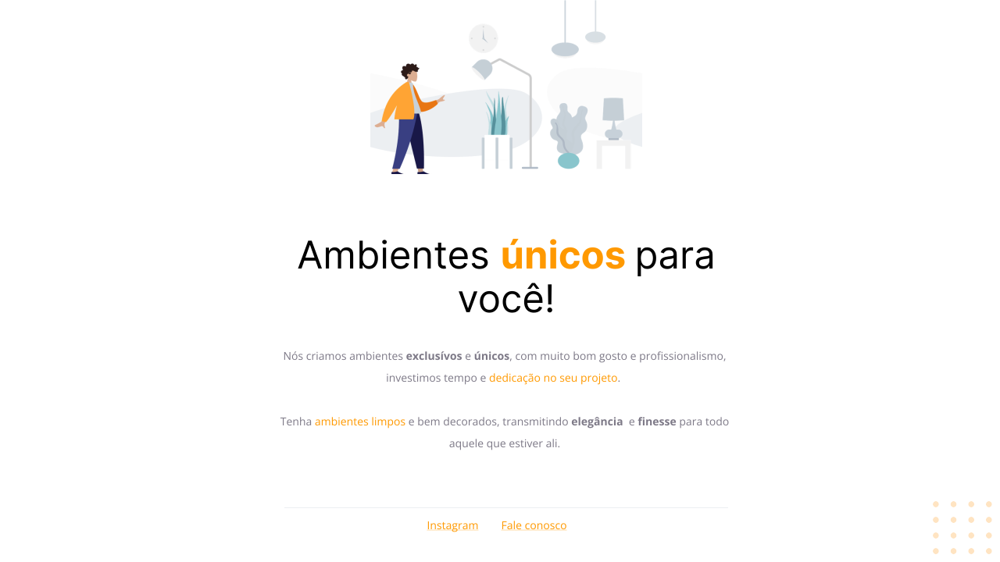

<strong> <h1 align="center"> Ambientes únicos para você </h1></strong>

## 🚀 Tecnologias

Esse projeto foi desenvolvido com as seguintes tecnologias:

- HTML
- CSS
- Git e Github

## 🏷️ Layout

Você pode visualizar o layoout do projeto através
[desse link](<https://www.figma.com/file/1nuO6DIrI5OFZ8rmTPITIg/Explorer---Projeto-01-(Copy)?type=design&node-id=0-1&mode=design&t=Ml7lQH3tT3ITotpC-0>).
É necessário ter uma conta no [Figma](https://www.figma.com)